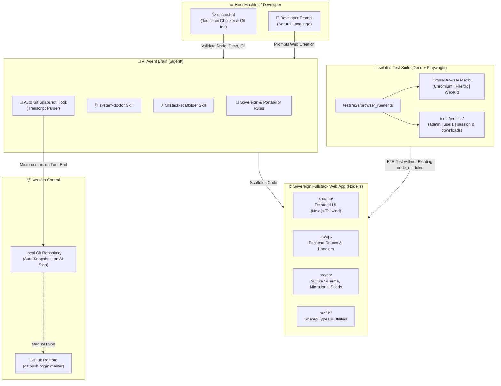

# 🚀 Node-Pocket: Sovereign Fullstack AI Generator

[อ่านภาษาไทย](README.md)


> **Sovereign Single-Project Fullstack Web App Generator for AI Agents (Google Antigravity & Gemini)**  
> Governed by the **"1 Folder = 1 Complete Web Application"** law | 100% Portable (**Zero Absolute Paths**) | Isolated Cross-Browser Matrix Testing via **Deno + Playwright** (zero `node_modules` pollution) | Built-in **Intelligent Auto Git Snapshot** engine.

---

## 📌 Overview

**Node-Pocket** is a master seed repository engineered to eliminate the chaos and architectural drift typically introduced when collaborating with AI coding agents. When left unconstrained, AI agents often produce nested subfolders, embed machine-dependent hardcoded absolute paths, and bloat project dependencies with testing harnesses.

Node-Pocket establishes a strict **Sovereign Single-Project** boundary where humans and AI agents collaborate seamlessly:
1. **Unified Fullstack Directory:** Frontend UI (`src/app`), Backend API Routes (`src/api`), Database Schemas & Migrations (`src/db`), and Shared Utilities (`src/lib`) reside under a single, cohesive `package.json`.
2. **100% Portable Across Machines:** Absolutely zero hardcoded paths (`C:\...` or `/home/...`). Every script uses relative path resolution, making the folder instantly portable via zip or flash drive.
3. **Externalized Testing Engine:** Cross-browser E2E tests run via Deno + Playwright independently from the web app, keeping the Node.js `node_modules` clean, lightweight, and bloat-free.
4. **Intelligent Micro-Commit Snapshots:** Integrated Antigravity agent hooks automatically commit changes locally upon every AI turn, parsing the user's intent directly from conversation transcripts.

---

## ✨ Key Features

- 🏰 **Sovereign Single-Project Boundary:** Enforces a single, self-contained architecture. No nested sub-projects. Need another app? Duplicate the master folder and spin up a new project.
- 🩺 **Automated Host Doctor (`doctor.bat` & `system-doctor` skill):** Verifies Node.js, Deno, Git, and Playwright browser binaries with a single click and automatically initializes a clean local Git baseline.
- ⚡ **AI Fullstack Scaffolding (`fullstack-scaffolder` skill):** Describe your app in natural language (e.g., *"Build an inventory tracking system with an approval dashboard and CSV export"*), and the AI scaffolds the entire stack.
- 🎭 **Zero-Bloat Cross-Browser Matrix Testing:** Run E2E tests across Chromium, Firefox, and WebKit (Safari) using Deno. Playwright is never installed in the web app's `package.json`.
- 👤 **Multi-Profile Isolation Engine:** Pre-configured user profiles (`admin`, `user1`, `_template`) isolate browser sessions, cookies, downloads, and mock IPs per browser engine.
- 📸 **Intelligent Auto Git Snapshot:** Automatically commits code to local Git whenever the AI completes an execution turn, extracting the commit message from the conversation context.
- 🧳 **Zero Absolute Paths:** Works anywhere out of the box without environment-specific configuration.

---

## 🛠️ System Architecture



---

## 📂 Directory Structure

```text
node-pocket/
├── .agent/                         # 🧠 AI Agent Brain & Governance
│   ├── rules/
│   │   ├── 01_SOVEREIGN_RULES.md   # Single-project boundary rules
│   │   ├── 02_CROSS_BROWSER_RULES.md# Test harness isolation rules
│   │   └── 03_PORTABILITY_RULES.md # Relative path & zero-dependency rules
│   ├── scripts/
│   │   └── auto_git_snapshot.ps1   # Transcript parser & micro-commit script
│   ├── skills/
│   │   ├── fullstack-scaffolder/   # Fullstack generation skill
│   │   └── system-doctor/          # Machine diagnostics skill
│   └── hooks.json                  # Antigravity 'Stop' event hook definition
│
├── src/                            # 🌐 Unified Fullstack Source Code
│   ├── api/                        # Backend API Endpoints (.gitkeep)
│   ├── app/                        # Frontend UI (Next.js App Router)
│   │   └── page.tsx                # Initial landing page placeholder
│   ├── db/                         # Database Schema, Migrations, Seeds (.gitkeep)
│   └── lib/                        # Shared Types & Helpers
│
├── tests/                          # 🧪 Cross-Browser Test Harness (Deno + Playwright)
│   ├── deno.json                   # Deno task configurations & external imports
│   ├── e2e/
│   │   ├── browser_runner.ts       # Browser engine launcher & session manager
│   │   └── ui_flow.test.ts         # End-to-end UI tests
│   └── profiles/                   # Multi-role test profiles
│       ├── _template/              # Template for new test profiles
│       ├── admin/                  # Admin role profile (IP, Viewport, Session)
│       └── user1/                  # Standard user profile
│
├── .env.example                    # Template for environment variables
├── .gitignore                      # Git exclusion rules
├── AGENTS.md                       # First-contact orientation for AI agents
├── doctor.bat                      # One-click host environment diagnostic script
├── package.json                    # Web application dependencies & npm scripts
└── README.md                       # Primary documentation (Thai)
```

---

## 🚀 Quick Start Guide

### Step 1: Run System Diagnostics
Double-click `doctor.bat` or run:
```bash
.\doctor.bat
```
The script validates your Node.js, Deno, and Git installations, and automatically initializes a local Git repository if one does not already exist.

---

### Step 2: Prompt AI to Scaffold Your Web App
Open this folder as a Workspace in your AI IDE (such as Google Antigravity or Gemini), then enter your requirement:
> *"Create a coffee shop ordering system with cart management, checkout, and an admin dashboard."*

The AI will trigger the `fullstack-scaffolder` skill to build out `src/` with UI components, API routes, and SQLite schema.

---

### Step 3: Install Dependencies & Run
```bash
# Install web dependencies
npm install

# Start development server
npm run dev
```
Navigate to `http://localhost:3000` in your browser.

---

### Step 4: Run Cross-Browser Matrix Tests
Execute automated tests across browser engines via Deno:
```bash
cd tests

# Run default test (Chromium)
deno task test

# Run specific browser
deno task test:chrome    # Google Chrome / Edge
deno task test:firefox   # Mozilla Firefox
deno task test:safari    # Apple Safari (WebKit)

# Run all 3 browsers in parallel
deno task test:all
```

---

### Step 5: Manage Snapshots & Git History
The background hook commits changes automatically whenever the AI completes an execution turn:
```bash
# View last 15 snapshot commits
npm run git:log

# Create a manual snapshot commit
npm run git:save

# Check repository status
npm run git:status
```

---

## 🧪 Testing Engine & Profile Isolation

The `tests/profiles/<username>/` directory isolates browser data per user role:
- **`profile.json`**: Role configuration, screen viewport, locale, and simulated IP address (injected via `x-forwarded-for` header).
- **`downloads/`**: Storage folder for files downloaded during automated tests.
- **`session.json`**: Preserves Playwright StorageState (cookies, localStorage) per browser engine to maintain authenticated state without re-logging in.

---

## 📜 Architectural Laws

1. **Sovereign Single-Project:** No nested sub-projects. Everything belongs inside `src/`.
2. **Zero Absolute Paths:** Absolute paths (`C:\...`) are strictly prohibited. Always use relative paths (`%~dp0`, `process.cwd()`, `import.meta.dirname`).
3. **Fullstack Unity:** Maintain a single `package.json` for all web application logic.
4. **Isolated Test Engine:** E2E tests live in `tests/` and run via Deno. Never install testing frameworks inside the web app's `node_modules`.
5. **Replication over Nesting:** When starting a new web app, duplicate the entire Node-Pocket folder instead of nesting folders.

---

## 📤 Publishing to GitHub

To push this repository to GitHub:

1. **Create a new repository on GitHub:** Visit [github.com/new](https://github.com/new) and name it `node-pocket` (leave "Add README" unchecked).
2. **Link the remote and push:**
   ```bash
   # Initialize git if not already present
   git init
   git add -A
   git commit -m "feat: initial commit for node-pocket sovereign generator"

   # Add remote origin (SSH or HTTPS)
   git remote add origin git@github.com:rathanon-dev/node-pocket.git

   # Push code to GitHub
   git branch -M master
   git push -u origin master
   ```

---

## 📄 License & Author

- **Developer:** [rathanon-dev](https://github.com/rathanon-dev)
- **Architecture:** Node-Pocket Architecture Framework
- **License:** [MIT License](LICENSE)
