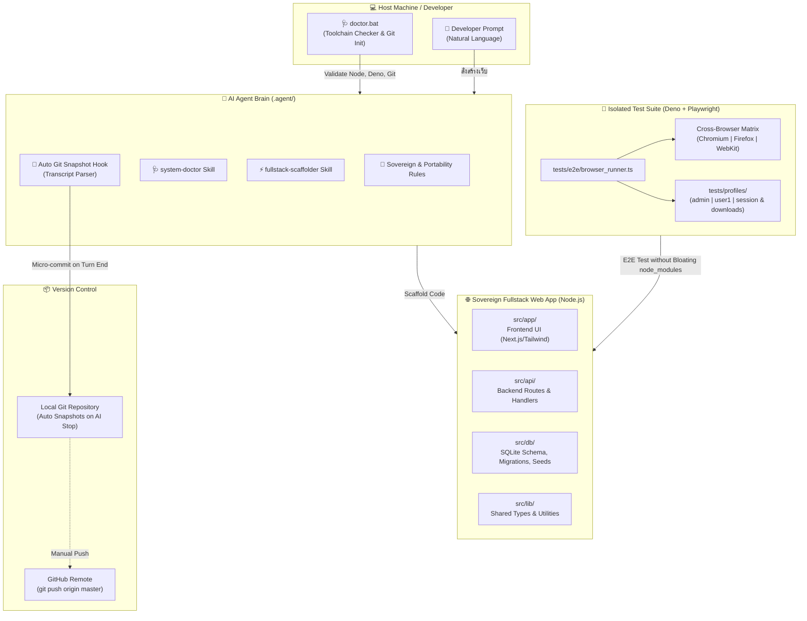

# 🚀 Node-Pocket: Sovereign Fullstack AI Generator

[Read in English](README.en.md)


> **Sovereign Single-Project Fullstack Web App Generator สำหรับ AI Agent (Google Antigravity & Gemini)**  
> ยึดหลักการ **"1 โฟลเดอร์ = 1 เว็บแอปพลิเคชันที่สมบูรณ์"** | พกพาสะดวก 100% (**Zero Absolute Paths**) | ทดสอบ 3 Browser Engines ด้วย **Deno + Playwright** โดยไม่เปลือง `node_modules` | พร้อมระบบ **Auto Git Snapshot** อัจฉริยะบันทึกประวัติการทำงานทุกรอบของ AI

---

## 📌 ภาพรวมโปรเจกต์ (Overview)

**Node-Pocket** คือเทมเพลตต้นแบบ (Master Seed) ที่ถูกออกแบบมาเพื่อแก้ปัญหาความยุ่งเหยิงของการพัฒนาเว็บแอปพลิเคชันร่วมกับ AI Agent ยุคใหม่ บ่อยครั้งที่ AI มักจะสร้างโฟลเดอร์ซ้อน (Nested Folders), เขียน Path แบบผูกติดเครื่อง (Hardcoded Absolute Paths), หรือติดตั้งเครื่องมือทดสอบจนขนาดโฟลเดอร์บวมมหาศาล

Node-Pocket กำหนดกรอบโครงสร้างและสถาปัตยกรรมแบบ **Sovereign Single-Project** ให้ AI และผู้พัฒนาทำงานร่วมกันได้อย่างราบรื่น:
1. **ครบวงจรในโฟลเดอร์เดียว:** มีทั้ง Frontend UI (`src/app`), Backend API (`src/api`), Database Schema/Seeds (`src/db`), และ Shared Utilities (`src/lib`) ภายใต้ `package.json` เดียว
2. **พกพาง่าย ปลอดภัยทุกระบบปฏิบัติการ:** ไม่มี Path แบบ `C:\...` หรือ `/home/...` ทุกอย่างอ้างอิงผ่าน Relative Path สามารถซิป ย้ายเครื่อง หรือเปิดใช้งานข้ามโฮสต์ได้ทันที
3. **แยกเอนจินการทดสอบออกจากตัวเว็บ:** รันการทดสอบ E2E ข้าม 3 เบราว์เซอร์หลัก (Chromium, Firefox, WebKit/Safari) ด้วย Deno ทำให้โปรเจกต์เว็บของ Node.js สะอาดและน้ำหนักเบา
4. **บันทึกประวัติอัตโนมัติ (Micro-Commit Guard):** ไม่ต้องกลัว AI แก้โค้ดพัง เพราะระบบมี Agent Hook คอยทำ Snapshot บันทึกการเปลี่ยนแปลงในเครื่องให้อัตโนมัติทุกครั้งที่ AI ขยับ

---

## ✨ คุณสมบัติเด่น (Key Features)

- 🏰 **Sovereign Single-Project Boundary:** สถาปัตยกรรมเอกเทศ 1 โฟลเดอร์ = 1 โปรเจกต์สมบูรณ์ ห้ามมี Sub-project ซ้อน หากต้องการทำเว็บใหม่ ให้คัดลอกโฟลเดอร์นี้ไปตั้งชื่อใหม่ได้ทันที
- 🩺 **Automated Host Doctor (`doctor.bat` & `system-doctor`):** ตรวจสอบความพร้อมของ Node.js, Deno, Git, และ Playwright Browsers ก่อนเริ่มงาน พร้อมช่วยเริ่ม Local Git Baseline ให้อัตโนมัติในคลิกเดียว
- ⚡ **AI Fullstack Scaffolding (`fullstack-scaffolder`):** เพียงป้อนความต้องการด้วยภาษาธรรมชาติ (เช่น *"สร้างเว็บร้านกาแฟ มีระบบสั่งซื้อ ชำระเงิน และหน้า Admin"*) AI จะประกอบร่าง Fullstack Web App ให้ทันที
- 🎭 **Zero-Bloat Cross-Browser Matrix Testing:** ทดสอบ Cross-Browser (Chromium / Firefox / WebKit) ด้วย **Deno + Playwright** จากภายนอก ไม่ต้องลง Playwright ใน `node_modules` ของเว็บให้กินเนื้อที่
- 👤 **Multi-Profile Isolation Engine:** มีระบบจำลองผู้ใช้หลายบทบาท (`admin`, `user1`, `_template`) ที่แยกเซสชัน คุกกี้ สตอเรจ โฟลเดอร์ดาวน์โหลด และจำลอง IP ได้อย่างอิสระ
- 📸 **Intelligent Auto Git Snapshot:** เชื่อมต่อกับ Antigravity Hook บันทึก Local Commit อัตโนมัติ โดยถอดรหัสความต้องการของผู้ใช้จาก Transcript สนทนามาตั้งเป็น Commit Message ป้องกันโค้ดสูญหาย
- 🧳 **100% Portability (Zero Absolute Paths):** พกพาใส่ Flash Drive ย้ายข้ามเครื่อง แตกไฟล์ที่ไหนก็ทำงานได้ทันที ไม่ผูกติดกับ Environment ของเครื่องใดเครื่องหนึ่ง

---

## 🛠️ สถาปัตยกรรมระบบ (Architecture)



---

## 📂 โครงสร้างโฟลเดอร์ (Directory Structure)

```text
node-pocket/
├── .agent/                         # 🧠 สมองและกฎของ AI Agent
│   ├── rules/
│   │   ├── 01_SOVEREIGN_RULES.md   # กฎสถาปัตยกรรมเอกเทศ 1 โฟลเดอร์ = 1 โปรเจกต์
│   │   ├── 02_CROSS_BROWSER_RULES.md# กฎการแยกเอนจินทดสอบและการจัดการโปรไฟล์
│   │   └── 03_PORTABILITY_RULES.md # กฎการพกพาและการใช้ Relative Path
│   ├── scripts/
│   │   └── auto_git_snapshot.ps1   # สคริปต์สกัด Prompt และทำ Micro-Commit อัตโนมัติ
│   ├── skills/
│   │   ├── fullstack-scaffolder/   # ทักษะการสร้างเว็บ Fullstack จาก Prompt
│   │   └── system-doctor/          # ทักษะการวินิจฉัยและเตรียมเครื่องมือ
│   └── hooks.json                  # การผูก Event 'Stop' เข้ากับ Auto Git Snapshot
│
├── src/                            # 🌐 ซอร์สโค้ด Fullstack (รวมทุกอย่างไว้ในที่เดียว)
│   ├── api/                        # Backend API Endpoints (.gitkeep)
│   ├── app/                        # Frontend UI (Next.js App Router, Pages, Components)
│   │   └── page.tsx                # หน้าแรกเริ่มต้น (Placeholder / Landing)
│   ├── db/                         # Database Schema, Migrations, Seeders (.gitkeep)
│   └── lib/                        # Shared Utilities & Helpers
│
├── tests/                          # 🧪 ชุดทดสอบ Cross-Browser ด้วย Deno + Playwright
│   ├── deno.json                   # การตั้งค่า Deno Tasks และ External Imports
│   ├── e2e/
│   │   ├── browser_runner.ts       # โมดูลควบคุม Browser Engine และ Session State
│   │   └── ui_flow.test.ts         # ชุดทดสอบหน้าบ้านและการทำงานของระบบ
│   └── profiles/                   # ข้อมูลจำลองผู้ใช้แยกโปรไฟล์
│       ├── _template/              # แม่แบบสำหรับสร้างผู้ใช้ใหม่
│       ├── admin/                  # โปรไฟล์สิทธิ์ผู้ดูแลระบบ (IP, Viewport, Session)
│       └── user1/                  # โปรไฟล์สิทธิ์ผู้ใช้งานทั่วไป
│
├── .env.example                    # แม่แบบค่า Environment Variables
├── .gitignore                      # กำหนดสิ่งที่ไม่นำขึ้น Git (node_modules, db, test cache)
├── AGENTS.md                       # เข็มทิศและกฎ First-Contact Protocol สำหรับ AI
├── doctor.bat                      # สคริปต์ตรวจสอบความพร้อมของระบบแบบคลิกเดียว
├── package.json                    # Dependencies ของเว็บแอปพลิเคชัน
└── README.md                       # คู่มือการใช้งานและเอกสารกำกับโปรเจกต์
```

---

## 🚀 เริ่มต้นใช้งาน (Quick Start)

### ขั้นตอนที่ 1: ตรวจเช็คเครื่องมือ (Diagnostic Check)
ดับเบิลคลิกไฟล์ `doctor.bat` หรือเปิด Terminal แล้วรัน:
```bash
.\doctor.bat
```
ระบบจะตรวจสอบว่าเครื่องของคุณมี Node.js, Deno, Git หรือไม่ หากยังไม่มี `.git` ในโฟลเดอร์ ระบบจะทำการ Initialized Repository ให้อัตโนมัติ

---

### ขั้นตอนที่ 2: สั่งงาน AI สร้างเว็บแอปพลิเคชัน
เปิดโฟลเดอร์นี้เป็น Workspace ใน AI IDE (เช่น Google Antigravity หรือ Gemini) จากนั้นพิมพ์สิ่งที่ต้องการ เช่น:
> *"สร้างระบบจองห้องประชุม มีปฏิทินแสดงผล ระบบล็อกอินผู้ใช้ และหน้าอนุมัติสำหรับผู้ดูแลระบบ"*

AI จะเรียกใช้ทักษะ `fullstack-scaffolder` เพื่อสร้างโครงสร้างใน `src/` (Frontend, API Routes, Database Schema) ให้ครบถ้วน

---

### ขั้นตอนที่ 3: ติดตั้ง Dependencies และรันเว็บ
```bash
# ติดตั้งไลบรารีของเว็บแอปพลิเคชัน
npm install

# รัน Development Server
npm run dev
```
เปิดเบราว์เซอร์ไปที่ `http://localhost:3000`

---

### ขั้นตอนที่ 4: รันชุดทดสอบ 3 เบราว์เซอร์ (Cross-Browser Matrix)
ทดสอบการทำงานของเว็บด้วย Deno (แยกอิสระจาก dependencies ของเว็บ):

```bash
cd tests

# ทดสอบเฉพาะ Chromium (Default)
deno task test

# หรือระบุเบราว์เซอร์ที่ต้องการ
deno task test:chrome    # Google Chrome / Edge
deno task test:firefox   # Mozilla Firefox
deno task test:safari    # Apple Safari (WebKit)

# ทดสอบพร้อมกันทั้ง 3 เบราว์เซอร์ (Matrix Test)
deno task test:all
```

---

### ขั้นตอนที่ 5: จัดการ Snapshot และประวัติการทำงาน (Git Commands)
เบื้องหลังจะมี Hook คอยทำ Commit ย่อยให้อัตโนมัติทุกครั้งที่ AI ทำงานเสร็จสิ้นในแต่ละรอบ:
```bash
# ดูประวัติ Snapshot ย้อนหลัง 15 รายการ
npm run git:log

# บันทึก Snapshot ด้วยตนเอง
npm run git:save

# ตรวจสอบสถานะไฟล์
npm run git:status
```

---

## 🧪 ระบบทดสอบ E2E และการจัดการโปรไฟล์ (User Profiles)

โครงสร้างโฟลเดอร์ `tests/profiles/<username>/` ถูกออกแบบมาเพื่อรองรับการทดสอบที่สมจริง:
- **`profile.json`**: กำหนดค่า Role, Viewport, Locale, และ Mock IP Address (ส่งผ่าน Header `x-forwarded-for`)
- **`downloads/`**: ที่เก็บไฟล์ที่เบราว์เซอร์ดาวน์โหลดลงมาระหว่างทดสอบ
- **`session.json`**: เก็บ Playwright StorageState (Cookies, LocalStorage) แยกตามเบราว์เซอร์ เพื่อให้ทดสอบต่อจากจุดเดิมได้โดยไม่ต้องล็อกอินซ้ำ

---

## 📜 กฎเหล็กสถาปัตยกรรม (Architectural Laws)

1. **Sovereign Single-Project:** ห้ามสร้าง Sub-project ซ้อนเด็ดขาด ทุกอย่างของเว็บต้องรวมศูนย์ใน `src/`
2. **Zero Absolute Paths:** ห้ามฮาร์ดโค้ด Path เด็ดขาด ให้ใช้ Relative Path เสมอ (`%~dp0`, `process.cwd()`, `import.meta.dirname`)
3. **Fullstack Unity:** รวม Frontend, API, และ Database อยู่ภายใต้ `package.json` เพียงชุดเดียว
4. **Isolated Test Engine:** การทดสอบ E2E ต้องอยู่ภายใต้ `tests/` รันด้วย Deno ห้ามนำไลบรารีทดสอบมาปะปนใน `package.json` ของเว็บ
5. **Replication over Nesting:** เมื่อต้องการสร้างเว็บใหม่ ให้ก๊อปปี้โฟลเดอร์ Node-Pocket ทั้งโฟลเดอร์ไปตั้งชื่อใหม่

---

## 📄 ลิขสิทธิ์และผู้พัฒนา (License & Author)

- **ผู้พัฒนา (Developer):** [rathanon-dev](https://github.com/rathanon-dev)
- **สถาปัตยกรรมและกรอบแนวคิด:** Node-Pocket Architecture Framework
- **สัญญาอนุญาต (License):** [MIT License](LICENSE)
